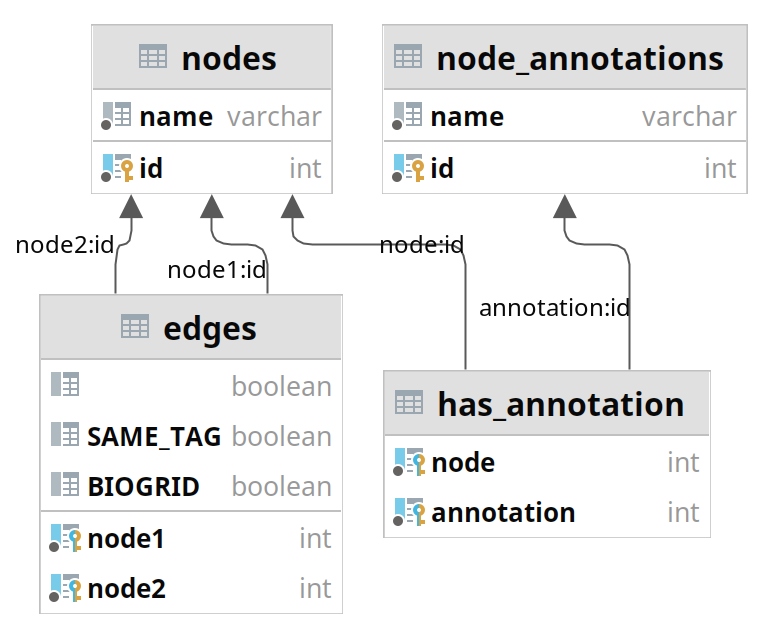

<!-- TOC -->

- [Tools provided in this repository](#tools-provided-in-this-repository)
- [License and Citing](#license-and-citing)
- [Usage Docker container](#usage-docker-container)
    - [Parameters for NeEDL](#parameters-for-needl)
        - [Quick Start / Example](#quick-start--example)
        - [Basic Setup](#basic-setup)
        - [Select your dataset](#select-your-dataset)
        - [Creation of the SSI network](#creation-of-the-ssi-network)
            - [Custom SNP annotation data](#custom-snp-annotation-data)
            - [Custom gene-gene/protein-protein interaction data](#custom-gene-geneprotein-protein-interaction-data)
        - [Selecting a seeding routine](#selecting-a-seeding-routine)
            - [RANDOM_CONNECTED seeding](#random_connected-seeding)
            - [COMMUNITY_WISE seeding](#community_wise-seeding)
            - [QUANTUM_COMPUTING seeding](#quantum_computing-seeding)
        - [Local search](#local-search)
    - [Documentation of the output files of NeEDL](#documentation-of-the-output-files-of-needl)
        - [General files](#general-files)
            - [run.log](#runlog)
            - [pipeline_config.json](#pipeline_configjson)
        - [Network files](#network-files)
            - [<network>_seeds.csv](#network_seedscsv)
            - [<network>_results.csv](#network_resultscsv)
            - [<network>_ind_SNP_scores.csv](#network_ind_snp_scorescsv)
            - [<network>_search_score_over_time.csv](#network_search_score_over_timecsv)
        - [<network>_network.sqlite3](#network_networksqlite3)
        - [<network>_joint_degree.csv](#network_joint_degreecsv)
    - [Advanced features of NeEDL](#advanced-features-of-needl)
        - [Additional analysis](#additional-analysis)
        - [Additional filters](#additional-filters)
        - [Multi-network approach](#multi-network-approach)
        - [Shuffle network](#shuffle-network)
    - [Parameters for epiJSON](#parameters-for-epijson)
        - [Quick Start](#quick-start)
        - [General parameters](#general-parameters)
        - [Selecting the input](#selecting-the-input)
        - [Filter selection](#filter-selection)
        - [Output files](#output-files)
        - [Shuffling the phenotype](#shuffling-the-phenotype)
    - [Parameters for calculate_scores](#parameters-for-calculate_scores)
        - [specify GWAS data](#specify-gwas-data)
        - [specify the SNP set data](#specify-the-snp-set-data)
        - [specify the output file](#specify-the-output-file)
        - [additional optional parameters](#additional-optional-parameters)
- [Usage via repository](#usage-via-repository)
    - [Dependencies](#dependencies)
    - [Building the tools](#building-the-tools)
    - [Additional parameters](#additional-parameters)

<!-- /TOC -->

# Tools provided in this repository
- NeEDL: Tool for fast network-based epistasis detection using local search
- epiJSON: Tool for converting various input and output formats which also can apply commonly used filtering steps. Needed to create the input files for NeEDL
- calculate_scores: A tool that can be used to calculate score of all statistical models supported by NeEDL (see Blumenthal et al. for further details)

# License and Citing

The project is distributed under the [GNU General Public License](https://www.gnu.org/licenses/gpl-3.0.en.html).

# Usage (Docker container)

**The easiest way to use our toolset is via our docker container**. This repo is big and contains much more than a typical user likely needs. Thus, we strongly encourage you to try out the docker container first, which comes with up-to-date versions of all of our tools in a smaller size.

In order to use our docker container, it is required to have docker installed. The user also needs permission to create and run docker containers (p.r.n., ask your system administrator). Additionally, a Python 3 installation and the command-line tool `curl` are necessary. To make all tools in this repository available in your current terminal session, please first source our installer script. This step needs to be done each time a new terminal session is started. It will only create some lightweight aliases, the actual download will take place only if you actually use one of the tools.
```bash
# install all tools in this repository for the current terminal session
if command -v shopt > /dev/null 2>&1 ; then shopt -s expand_aliases; fi
needl_install_sh="$(curl -s https://raw.githubusercontent.com/biomedbigdata/NeEDL/main/run/bash_install.sh)" && eval "$needl_install_sh"
```

After that, you can use our tools in the following way:
```bash
# run NeEDL
NeEDL <parameters...>
```
```bash
# run epiJSON
epiJSON <parameters...>
```
```bash
# run calculate_scores
calculate_scores <parameters...>
```


All parameters that can be used with the tools are explained below.

Example command to check that everything works:
```bash
NeEDL --help
```
This sould print out a long list of command line options if everything worked correctly.


## Parameters for NeEDL

### Quick Start / Example
To run NeEDL the default way that we also used during our publication use the following arguments:
```bash
--num-threads <num-threads>
--output-directory <output-directory>
--input-format JSON_EPIGEN
--input-path <input-JSON-file-created-with-epiJSON>
--phenotype DICHOTOMOUS
--snp-annotate-dbSNP
--network-BIOGRID
--ms-seeding-routine RANDOM_CONNECTED
--ms-rc-start-seeds 5000
--ms-model PENETRANCE_NLL
```

The full command then looks like this (Please follow the install step at the beginning of this readme before using this command):
```bash
NeEDL \
    --num-threads <num-threads> \
    --output-directory <output-directory> \
    --input-format JSON_EPIGEN \
    --input-path <input-JSON-file-created-with-epiJSON> \
    --phenotype DICHOTOMOUS \
    --snp-annotate-dbSNP \
    --network-BIOGRID \
    --ms-seeding-routine RANDOM_CONNECTED \
    --ms-rc-start-seeds 5000 \
    --ms-model PENETRANCE_NLL
```

Please replace `<...>` with your value of choice.

### Basic Setup
```bash
# if set to 0, all available threads will be used (please set explicit number of threads for use with slurm!)
--num-threads <num-threads>

# Give a path to an existing output directory. Inside the directory, each run will create its unique subdirectory with timestamp and a random number, so multiple runs can use the same output directory. All intermediate and final results (and debug info) are written to this directory.
--output-directory <path>

# Per default, the generated SNP-SNP-interaction network will be stored in the output folder in form of a sqlite database. This database file can get quite big for larger datasets.
# If you do not want this to happen due to memory reasons, please use this flag to deactivate saving the network to disk.
--disable-save-network


# By default, NeEDL calculates all available statistical scores for the final results and stores them in the result file. This step can be time consuming. If this flag is set, only the score used in the local search step will be calculated for the results (see parameter --ms-model).
--no-additional-scores
```

### Select your dataset
```bash
# Our default format is JSON_EPIGEN. You can use epiJSON to convert various commonly used file formats into this JSON format.
--input-format JSON_EPIGEN

# The input file path. Either specify a path to a .json file or path to a directory containing only one .json file.
--input-path <path>

# Phenotype information of the dataset. NeEDL can deal with DICHOTOMOUS, CATEGORICAL and QUANTITATIVE phenotypes. --num-categories is only necessary for CATEGORICAL phenotypes with more than two categories.
--phenotype CATEGORICAL
--num-categories 2
```

### Creation of the SSI network
The creation of the SSI network consists of two phases. First, all SNPs need to be annotated with labels (usually gene labels, but can, in general, be anything). Second, NeEDL creates all edges of the network. SNPs with at least one common label are connected. SNPs that have two different labels are connected if the two labels are set into relation in a label-label interaction network. The default is to use gene names as labels and the protein-protein interaction network BioGRID for the creation of the network.

For this default case which most users probably want to use one has to set the following two flags:
```bash
# annotate SNPs with gene labels from dbSNP
--snp-annotate-dbSNP

# connect SNPs that are labeled with genes which interact according to BioGRID
--network-BIOGRID
```

NeEDL is very versatile and can be used with custom data as well. You can select your data for labeling and interactions:

#### Custom SNP annotation data
Custom SNP annotation data needs to be provided in CSV format. Two columns need to be present, one that contains the SNP identifiers (usually RS-IDs) and another that contains the labels. In both columns, multiple entries can be provided within one row to reduce the size of the file (please set the separator characters accordingly, see below):
Example:
```
SNP             gene
rs123           ABC1
rs123           DEF2
rs456           ABC1
rs456           DEF2
rs789           XYZ9
```

```
SNP             gene
rs123,rs456     ABC1,DEF2
rs789           XYZ9
```

```bash
--snp-annotate "<path>|<has_header>|<snp_col>|<annotation_col>|<csv_separator>|<snp_separator>|<annotation_separator>"
```
- `<path>`: path to the CSV file (either relative to the current working directory or an absolute path)
- `<has_header>`: either `yes` or `no` depending on whether the CSV file has a header line
- `<snp_col1>`: Descriptor of the column containing the SNP identifiers. Can be a zero-based index or, if the CSV file has a header line, it can also be the name of the column
- `<annotation_col>`: Descriptor of the column containing the gene annotations. Can be a zero-based index or, if the CSV file has a header line, it can also be the name of the column
- `<separator_csv>`: character which separates the columns in the CSV file, e.g., `,` or `\t` (in most terminals one might need to use `\\t` instead of `\t` to escape the backslash properly)
- `<separator_col1>`: character which separates multiple entries in the SNP identifier column, if every row contains exactly one entry please set it to `-1`
- `<separator_col2>`: character which separates multiple entries in the annotation column, if every row contains exactly one entry please set it to `-1`

Multiple commands for SNP annotation can be set in a single run to use labels from different sources.

#### Custom gene-gene/protein-protein interaction data
The interaction data needs to be provided in CSV format. Two columns need to be present which contain the SNP labels which interact and thus connect within the gene-gene interaction network. It can be considered an edge list of that network. NeEDL allows using multiple labels per cell of the CSV file to store information more densely.
Example:
The following two files produce induce the same network if the separator characters are set correctly (see the usage of the argument below):
```
gene1       gene2
ABC1        DEF1
ABC1        DEF2
ABC2        DEF1
ABC2        DEF2
XYZ1        XYZ2
```
```
gene1       gene2
ABC1,ABC2   DEF1,DEF2
XYZ1        XYZ2
```

To select a custom source for labeling the SNPs please use the following argument which contains 8 sub-argument separated by the character "`|`":
```bash
--network "<network_name>|<path>|<has_header>|<col1>|<col2>|<separator_csv>|<separator_col1>|<separator_col2>"
```
- `<network_name>`: a unique name for the network, only characters that are valid in a filename are allowed
- `<path>`: path to the CSV file (either relative to the current working directory or an absolute path)
- `<has_header>`: either `yes` or `no` depending on whether the CSV file has a header line
- `<col1>`: Descriptor of the first column. Can be a zero-based index or, if the csv file has a header line, it can also be the name of the column
- `<col2>`: Descriptor of the second column. Can be a zero-based index or, if the CSV file has a header line, it can also be the name of the column
- `<separator_csv>`: character which separates the columns in the CSV file, e.g., `,` or `\t` (in most terminals one might need to use `\\t` instead of `\t` to escape the backslash properly)
- `<separator_col1>`: character which separates multiple entries in the first column, if every row contains exactly one entry please set it to `-1`
- `<separator_col2>`: character which separates multiple entries in the second column, if every row contains exactly one entry please set it to `-1`

NeEDL supports using multiple network files in one run. If so, the local search is performed for each network individually and the results are aggregated afterward with the help of an additional local search run. The multiple networks approach is not fully evaluated yet. Please consider the section *Advanced/Multi-network approach* before using multiple networks.

### Selecting a seeding routine
NeEDL supports different seeding routines for the local search which come with different advantages and disadvantages. In our publication, we used RANDOM_CONNECTED seeding for all our tests. It is generally a good choice. However, the user has to decide how many seeds should be generated which influences the quality of the results. If you do not know how many seeds to use we suggest trying out the COMMUNITY_WISE seeding as it decides how many seeds should be used based on the network size and architecture.

#### RANDOM_CONNECTED seeding
Random connected seeding selects pairs of SNPs that are connected in the SSI network. In our publication, we used this seeding method with 5000 start seeds for our runs.

```bash
# set the seeding routine
--ms-seeding-routine RANDOM_CONNECTED

# select the number of start seeds to use for the local search. This value has a nearly linear impact on the runtime of NeEDL.
--ms-rc-start-seeds 5000
```

#### COMMUNITY_WISE seeding
Performs community detection on the SSI network producing clusters/communities with a given maximum size. For each cluster, several start seed candidates are selected randomly. Afterward, the start seeds are picked from these candidates. The algorithm then makes sure that at least one seed from every cluster is used and that the top $n\%$ of all seed candidates w.r.t. their statistical score is selected.

```bash
# set the seeding routine
--ms-seeding-routine COMMUNITY_WISE

# configure the described options
--ms-cw-quantile 0.25          # pick the 25% best seed candidates
--ms-cw-max-cluster-size 1000  # maximum cluster size allowed
--ms-cw-num-sets-per-cluster 5 # how many seed candidates are generated per cluster
```

#### QUANTUM_COMPUTING seeding
This seeding routine derives from the COMMUNITY_WISE seeing. Hence, all parameters starting with `--ms-cw-...` that are explained above are also available here. Instead of picking random start seeds for each community like the COMMUNITY_WISE seeding does, QUANTUM_COMPUTING seeding uses a quantum computing-based algorithm to select the seed candidates. As this algorithm is potentially resource intensive, one can select to only perform it on clusters of a certain size.

```bash
# set the seeding routine
--ms-seeding-routine QUANTUM_COMPUTING

# hyperparameters

# QC is not applied on every found community but just on communites of a certain minimum size. Smaller communities are handled like COMMUNITY_WISE seeding was selected
--ms-qc-min-cluster-size 100


# Hardware-agnostic hyperparameters
--ms-qc-n-clique 2      # number of distinct solutions returned for each single instance of the optimization problem
--ms-qc-k 3             # preferred clique size
--ms-qc-nu 0.5          # weight of the linear combination between biological and statistical information of SNP interaction
--ms-qc-lambda0 5.0     # strength of the first term of the QUBO formulation
--ms-qc-lambda1 1.0     # strength of the second term of the QUBO formulation
--ms-qc-lambda2 1.0     # strength of the third term of the QUBO formulation (divergence between the distinct solution returned)
```

The QUANTUM_COMPUTING seeding support three different hardware types. Options are SIMULATED_ANNEALING, QUANTUM_ANNEALING, and QAOA. Depending on the selected hardware different additional parameters are needed as you can see below:

```bash
# for SIMULATED_ANNEALING
--ms-qc-mode SIMULATED_ANNEALING    # run optimization with simulated annealing on CPU
--ms-qc-sa-num-samples 10           # number of samples drawn at the end of the process
--ms-qc-sa-num-sweeps 1000          # Number of sweep (state updates) in a single execution 
--ms-qc-sa-seed 1234                # random seed


# for QUANTUM_ANNEALING
--ms-qc-mode QUANTUM_ANNEALING          # run optimization with quantum annealing on D-Wave quantum device
--ms-qc-qa-token "abc"                  # D-Wave cloud platform token
--ms-qc-qa-num-reads 10                 # number of samples drawn at the end of the process
--ms-qc-qa-solver-idx 4                 # Index of the solver, namely 0 = 'hybrid_binary_quadratic_model_version2', 1 = 'hybrid_discrete_quadratic_model_version1', 2 = 'hybrid_constrained_quadratic_model_version1p', 3 = 'Advantage_system4.1', 4 = 'Advantage_system6.1', 5 = 'DW_2000Q_6', 6 = 'DW_2000Q_VFYC_6'.
--ms-qc-qa-fw-annealing-ramp-time 1.0   # Ramp time in ms during forward annealing  
--ms-qc-qa-fw-annealing-pause-time 1.0  # Pause time in ms during forward annealing
--ms-qc-qa-rev-annealing-ramp-time 1.0  # Ramp time in ms during reverse annealing
--ms-qc-qa-rev-annealing-pause-time 1.0 # Pause time in ms during reverse annealing
--ms-qc-qa-rev-annealing-s-target 1.0   # Minimum reverse evolution 

# for QAOA
--ms-qc-mode QAOA
--ms-qc-qaoa-vendor azure               # Quantum vendor, 'none' or 'ibm' or 'azure'
--ms-qc-qaoa-azure-subscription-id abc  # For Azure quantum, the subscription id
--ms-qc-qaoa-azure-location west-europe # For Azure quantum, the location of the Azure account
--ms-qc-qaoa-azure-backend ionq_xxx     # Name of the quantum device for IBM or Azure quantum machines
--ms-qc-qaoa-optimizer ADAM             # Optimization technique for QAOA parameters, namely String: 'ADAM', 'COBYLA', 'NELDER_MEAD', or 'SLSQP'
--ms-qc-qaoa-maxiter 10                 # Number of training epochs
--ms-qc-qaoa-reps 5                     # Number of repetition of the QAOA algorithm
--ms-qc-qaoa-n-shots 1024               # Number of samples drawn from the quantum circuit, suggested at least 1024
--ms-qc-qaoa-is-recursive-qaoa 0        # If set to '1' enable to Recursive version of QAOA, which is much more expensive
```


### Local search
One can influence how the local search that NeEDL applies to the SSI network behaves. The most important setting is the statistical score that should be used for optimization. We recommend using the score ```PENETRANCE_NLL``` for optimization.
```bash
# select score for optimization
--ms-model PENETRANCE_NLL

# optionally select a time limit for search
--ms-per-seed-time-limit 10m   # default is no limit
--ms-search-time-limit 3d  # default is no limit

# optionally set a different value for the maximal rounds (=iterations) of the local search
--ms-max-rounds 300

# optionally modify the allowed SNP set sizes, default size is between 2 and 10
--ms-min-set 2
--ms-max-set 10

# The arguments below usually are not necessary to be set. The change the behaviour of the simulated annealing
--ms-annealing-type SIMULATED_ANNEALING
--ms-cooling-factor 1.0
--ms-annealing-start-prob 0.8
--ms-annealing-end-prob 0.01
```

NeEDL supports various statistical scores that can be used for `--ms-model`. Please refer to Blumenthal et al. (doi: [10.1093/bioinformatics/btaa990](https://doi.org/10.1093/bioinformatics/btaa990)) for details about the provided models. All scores work with `CATEGORICAL` and `QUANTITATIVE` phenotypes. Here is a full list of scores NeEDL supports for optimization:
- `BAYESIAN`: K2 score
- `VARIANCE`: $P$-value of the $\chi^2$ test
- `PENETRANCE_NLL`: negative log-likelihood of the maximum-likelihood model
- `PENETRANCE_LLH`: likelihood of the maximum-likelihood model
- `PENETRANCE_AIC`: Aikake information criterion of the maximum-likelihood model
- `PENETRANCE_BIC`: Bayesian information criterion of the maximum-likelihood model
- `REGRESSION_NLL`: negative log-likelihood of the quadratic-regression model
- `REGRESSION_LLH`: likelihood of the quadratic-regression model
- `REGRESSION_AIC`: Akaike information criterion of the quadratic-regression model
- `REGRESSION_BIC`: Bayesian information criterion of the quadratic-regression model
- `REGRESSION_NLL_GAIN`: negative log-likelihood gain of the quadratic-regression model
- `REGRESSION_LLH_GAIN`: likelihood gain of the quadratic-regression model
- `REGRESSION_AIC_GAIN`: Akaike information criterion gain of the quadratic-regression model
- `REGRESSION_BIC_GAIN`: Bayesian information criterion gain of the quadratic-regression model

Options for the annealing type are `SIMULATED_ANNEALING`, `RANDOM_ANNEALING`, `HYPERBOLIC_TAN_ANNEALING`.

## Documentation of the output files of NeEDL
NeEDL creates a new subdirectory within the output directory for every run. The directory consits of the date, time and a random number. This allows the user to start multiple runs of NeEDL with the same output directory in parallel without risking to override any results. 

### General files
#### `run.log`
This text file is always created and holds all information about how the NeEDL pipeline was executed and contains additional data like the network properties and the resource usage of NeEDL.

#### `pipeline_config.json`
This JSON file describes how exactly the pipeline was configured for the run and holds all relevant configuration parameters (required, optional, and internal ones). It can help to integrate the NeEDL results into other workflows.

### Network files
The files below are created once for every specified network. In the default configuration (use with BioGRID or a single custom network) these files only exist once. `<network>` is replaced with the name of the used network (default: BIOGRID).

#### `<network>_seeds.csv`
This CSV file contains the start seeds used for the local search on network `<network>`.

The file contains the following columns:
- `RANK (<score>)`: Rank of the start seed w.r.t. to the statistical score used (low rank is better). NeEDL always uses the score for ranking that is specified for the optimization during the local search (specified via `--ms-model`).
- `RS_IDS`: `;`-separated list of SNPs in the start seed (rsID from dbSNP)
- `<score>`: One column for every available statistical score. If `--no-additional-scores` is set, only one column with the score used during optimization in the local search is present.
- `SEED_ORIGIN`: Seeding routine or decision that generated the start seed.
- `ANNOTATIONS`: Annotations (default: gene annotations when using `--snp-annotate-dbSNP`) that are associated with at least one of the SNPs in the start seed. 

Optional columns when using categorical or dichotomous phenotypes. All columns below are present once for each category where `<value>` is replaced by the respective value of the category:
- `NUM_INDIVIDUALS_<value>`: number of individuals with the phenotype `<value>` that have at least one minor allele at all SNPs in the set
- `FREQ_INDIVIDUALS_<value>`: ratio of individuals with the phenotype `<value>` that have at least one minor allele at all SNPs in the set
- `INDIVIDUALS_<value>`: List of indices (zero-based) of all individuals with the phenotype `<value>` that have at least one minor allele at all SNPs in the set

#### `<network>_results.csv`
This CSV file contains the results of the local search on network `<network>`. This usually is the final result of NeEDL (if only a single network is used, see *Advanced/Multi-network approach*).

The file contains the following columns:
- `RANK (<score>)`: Rank of the result SNP set w.r.t. to the statistical score used (low rank is better). NeEDL always uses the score for ranking that is specified for the optimization during the local search (specified via `--ms-model`).
- `RS_IDS`: `;`-separated list of SNPs in the result SNP set (rsID from dbSNP)
- `<score>`: One column for every available statistical score. If `--no-additional-scores` is set, only one column with the score used during optimization in the local search is present.

The local search can potentially find some results multiple times if they are reachable in the network from multiple start seeds. The following parameters give information about the merged results:
- `NUM_MERGED`: number of results that were merged (because the SNP set is identical)
- `NUM_ROUNDS_ALL`: Number of rounds of the local search each seed needed to reach the result state (`;`-separated list)
- `NUM_ROUNDS_DISTINCT`: Same as `NUM_ROUNDS_ALL` but without duplicate values (`;`-separated list)
- `SEED_ORIGIN_ALL`: Seeding routine or decision that generated the start seed that reached the result SNP set (`;`-separated list)
- `SEED_ORIGIN_DISTINCT`: Same as `SEED_ORIGIN_ALL` but without duplicate values (`;`-separated list)
- `STOPPING_REASON_ALL`: Reason for the stopping reason for the local search on the SNP set (`;`-separated list)
- `STOPPING_REASON_DISTINCT`: Same as `STOPPING_REASON_ALL` but without duplicate values (`;`-separated list)


- `ANNOTATIONS`: Annotations (default: gene annotations when using `--snp-annotate-dbSNP`) that are associated with at least one of the SNPs in the result SNP set. 

Optional columns when using categorical or dichotomous phenotypes. All columns below are present once for each category where `<value>` is replaced by the respective value of the category:
- `NUM_INDIVIDUALS_<value>`: number of individuals with the phenotype `<value>` that have at least one minor allele at all SNPs in the set
- `FREQ_INDIVIDUALS_<value>`: ratio of individuals with the phenotype `<value>` that have at least one minor allele at all SNPs in the set
- `INDIVIDUALS_<value>`: List of indices (zero-based) of all individuals with the phenotype `<value>` that have at least one minor allele at all SNPs in the set

#### `<network>_ind_SNP_scores.csv`
This CSV file contains information about all SNPs that are present in at least one result SNP set. It has the same columns as the `<network>_seeds.csv` file except the `SEED_ORIGIN` column. Every SNP is treated as a SNP set with size 1.

#### `<network>_search_score_over_time.csv`
This CSV file documents how the score quality improves during the local search. It tracks the score value of the globally most optimal SNP set NeEDL found so far during the local search. This file shows how quickly NeEDL converged towards the final optimum it found.

The file consists of two columns:
- `time (ms)`: elapsed time since the start of the local search step, when this score was first reported
- `score`: Current lowest score at the specific time point of the local search. The score always is the same as used for optimization in the local search (specified via `--ms-model`).


### `<network>_network.sqlite3`
This SQLite3 database file contains the full SNP-SNP-interaction network together with annotation information. This file is only created if the flag `--disable-save-network` is not set. Depending on the size of the input files, this file can get very big (> 2 GB). Please consider before running NeEDL whether you require the SSI network for downstream analysis. Otherwise, disable saving it.

The database file has the following tables:


### `<network>_joint_degree.csv`
This CSV file represents a matrix which counts how often two nodes with a specific degree are contected in the SSI network. This information can give insights into the network architecture. The file will only be created if the flag `--do-joint-degree-analysis` is set (see *Advanced/Additional analysis*)

The file has a header containing a ascending list of node degrees in the SSI network and one column `TOTAL`. Without the header row and the `TOTAL` column, the file can be considered a matrix that counts how often two nodes with a specific degree are connected. The value at position $i,j$ in that matrix depicts how often a node with degree at the $i$-th cell in the header row is connected to a node with degree at the $j$-th cell in the header row. The `TOTAL` column depicts how many nodes have the respective degree.

## Advanced features of NeEDL

### Additional analysis
```bash
# Activates a joint-degree analysis. It creates an additional file containing information about the node degrees of connected SNPs in the SNP-SNP-interaction network. This flag is usually not necessary if one does not want to further investigate the network created by NeEDL.
--do-joint-degree-analysis

# NeEDL always prints general information about the created SSI-network in the logfile. If this flag is set, additional metrics are be calculated that are more computationally expensive. This flag should not be used on large networks.
--calculate-advanced-network-statistcs
```

### Additional filters
The maximum marginal association (MMA) filter sorts out SNPs that individually are already strongly associated with the phenotype. The $P$-value of the $\chi^2$ test is used in this filter. It is activated by setting a filter threshold. The $P$-values can also be corrected with Benjamini-Hochberg before applying the filter.
```bash
# Select a filter cutoff for the MMA filter. The filter excludes all SNPs with a lower $P$-value than the cutoff.
--mma-filter <cutoff-value>

# optionally do Benjamini-Hochberg correction before the filtering step:
--mma-use-BH-correction
```

NeEDL can perform linkage disequilibrium checks during local search. Please use the following parameters to activate the LD filtering.
```bash
# Activates linkage disequilibrium checking during local search
--ms-ld-check

# Path to an LD matrix in CSV format that has the same order of SNPs as the input file
--ms-ld-matrix <path>

# The LD mode specifies how individual LD values are aggregated. OPTIONS are MEAN, MAX. DEFAULT: MEAN
--ms-ld-mode MEAN

# If this LD cutoff is not set, monte carlo sampling is performed.
--ms-ld-cutoff <cutoff>

# If no LD cutoff is set, monte carlo sampling is performed which samples random SNP sets with given min size. DEFAULT: 2
--ms-ld-mc-min-set 2

# If no LD cutoff is set, monte carlo sampling is performed which samples random SNP sets with given max size. DEFAULT: 10
--ms-ld-mc-max-set 10

# If no LD cutoff is set, monte carlo sampling is performed. This options specifies how many samples are generated during the monte carlo process DEFAULT: 1000
--ms-ld-mc-num-samples 1000
```

### Multi-network approach
NeEDL supports using multiple network files in one run. If so, the local search is performed for each network individually and the results are aggregated afterward with the help of an additional local search run. The multiple networks approach is not fully evaluated yet.

Multiple networks can be selected by specifying the `--network` parameter more than once. Every network is then processed separately. All parameters in this README that start with `--ms-*` configure how the local search at this stage will perform. Every `--ms-*` parameter can be configured either
- not at all, if it is an optional parameter and the default should be used for all networks,
- once, if the value should be used for all networks,
- or once for each network, to specify a value for each network individually.

After all networks have been processed, NeEDL aggregates the result SNP sets from each network into a new network by connecting SNPs that correspond to the same set in one of the results. This network is then used to perform another local search run to refine and combine the findings from the multiple networks. All parameters that start with `--ms-*` also exist with the prefix `--fs-*` which corresponds to the final search. The `--fs-*` parameters control the final local search. The final local search creates the same output files as the intermediate local search instances but uses the prefix `result_` for all files.


All intermediate results of the multi-network local search runs are also saved into the results folder. Hence, one can also use the multi-network mode to run the local search on multiple networks, without aggregating the results in the end. In that case, one can specify the flag `--disable-final-search` to prevent NeEDL from aggregating and searching again.

### Shuffle network
NeEDL optionally can shuffle the created SSI network. This option is useful to test how much the prior biological knowledge improves the quality of the results. This feature is not relevant for users who just want to do epistasis detection.

```bash
--network-shuffle-method <METHOD>
```

NeEDL supports four different shuffle methods:
- `TOPOLOGY_PRESERVING_WITH_SNP_DEGREE`: This method keeps the network structure and shuffles the node labels (= SNPs). Only the SNPs with the same degree are exchanged to keep the original degree of every SNP in the network.
- `TOPOLOGY_PRESERVING_WITHOUT_SNP_DEGREE`: This method keeps the network structure and shuffles the node labels (= SNPs). Only the SNPs with the same degree are exchanged to keep the original degree of every SNP in the network.
- `EXPECTED_DEGREE_KEEP_DEGREE_DISTRIBUTION`: This method creates a new network structure so that the degree distribution of the SNPs in the new network is approximately the same as the degree distribution in the original network.
- `EXPECTED_DEGREE_KEEP_INDIVIDUAL_DEGREE`: This method creates a new network structure so that every SNP gets a degree in the new network that is as close as possible to its degree in the original network.


## Parameters for epiJSON
epiJSON is a wrapper around plink that can convert several plink-readable input files and apply several filters typically used for GWAS. It can also create the JSON_EPIGEN files that NeEDL requires as input. The following input and output formats are supported:
- `.bim/.bed./.fam`
- `.ped/.map`
- `.tped/.tfam`
- `.vcf`
- `.bcf2`
- `.json`: JSON_EPIGEN (input for NeEDL)
- MACOED input files (*can only be generated not read by epiJSON*)
- LINDEN input files (*can only be generated not read by epiJSON*)

### Quick Start
Quickly convert your files into the correct format for NeEDL without applying any optional filters (Please follow the install step at the beginning of this readme before using this command):
```bash
epiJSON \
    --num-threads <num-threads> \
    --output-directory <output-directory> \
    --input-file <path-to-input> \
    --input-format <BIM_BED_FAM|PED_MAP|TPED_TFAM|VCF|BCF2|JSON> \
    --phenotype <DICHOTOMOUS|CATEGORICAL|QUANTIATIVE> \
    --make-json
```

### General parameters
```bash
# Specifiy how many threads epiJSON should use. Most steps will still be run single-threaded.
--num-threads <num-threads>

# Specify an empty and existing output directory where all final files will be written to
--output-directory <path-to-existing-empty-directory>

# Set the phenotype
--phenotype <DICHOTOMOUS|CATEGORICAL|QUANTITATIVE>

# Optionally set the number of categories for a CATEGORICAL phenotype
--num-categories <number>
```

### Selecting the input
epiJSON supports joining multiple input files (possibly of different file type) together. This can be especially helpful if one has cases and controls in separate files. epiJSON can also override the phenotype for each input file.

For every input file specify these parameters:
```bash
--input-file <path>

# Explicitly tell epiJSON the input format. If omitted, epiJSON tries to guess which file to use.
--input-format <BIM_BED_FAM|PED_MAP|TPED_TFAM|VCF|BCF2>

# By default epiJSON uses the phenotype reported in the input file. Optionally, one can specify a phenotype for each file that should be used instead of the reported phenotype that is contained in the input.
--override-phenotype <value>
```

Example for combining separate case and control files (Please follow the install step at the beginning of this readme before using this command):
```bash
epiJSON \
    --num-threads 1 \
    --output-directory combined_dataset \
    \
    --input-file cases \
    --input-format BIM_BED_FAM \
    --override-phenotype 2 \
    \
    --input-file controls \
    --input-format BIM_BED_FAM \
    --override-phenotype 1 \
    \
    --phenotype DICHOTOMOUS \
    --make-json
```

`--override-phenotype` and `--input-format` can be specified only once if the same value should be used for all input files.

There is the special case where one might want to override the phenotype only for some input files but not all. To do that, please set `--override-phenotype` to `NO` for the files that you do not want to override. If all phenotype values should be sourced from the input file, then simply do not specify any `--override-phenotype` parameter.

### Filter selection
```bash
# select all available filters
--all-filters


# Filter out any variants which IDs do not start with 'rs'
--filter-rsids

# Apply plink's duplicate filter
--filter-duplicates

# Filters out all genotypes and individuals with > 0.2 missing values.
--filter-missing

# Filters out samples with discrepancy between reported sex and sex according to genome.
--filter-sex-discrepance

# Apply MAF filter with threshold 0.05 for sets with #individuals < 50,000 and 0.01 else.
--filter-allele-frequency

# Filter based on the Hard-Weinberg test.
--filter-hardy-weinberg

# Erases heterzygous haploid and nonnormal Y chromosome genotype calls.
--filter-hh-missing

# Filters out all SNPs that would not be part of the dbSNP/BioGRID based SNP-SNP-interaction network used by NeEDL.
--filter-snp-network
```

### Output files
```bash
# Generate all available output files. (LINDEN and MACOED files will only be created if phenotype is DICHOTOMOUS)
--make-all-formats

# Create JSON_EPIGEN for NeEDL
--make-json

# Create .bim/.bed/.fam files
--make-bim-bed-fam

# Create .ped/.map files
--make-ped-map

# Create .tped/.tfam files
--make-tped-tfam

# Create a VCFv4.2 file which is block-gzipped
--make-vcf

# Create input files for the tool LINDEN
--make-linden

# Create input file for the tool MACOED
--make-macoed
```

### Shuffling the phenotype
The tool epiJSON can also shuffle the phenotype vector after processing all filters. This feature can be activated with the following flag:
```bash
--shuffle-phenotype
```

## Parameters for calculate_scores
With calculate_scores the user can apply the statistical models mentioned in *Local search* to custom data. The tool reads the GWAS data in JSON_EPIGEN format (can be created with epiJSON from various common file formats) and a list of SNP sets in CSV format. It calculates the requested scores for the sets and outputs everything in the same CSV format that NeEDL uses for its results.

### specify GWAS data
```bash
# Our default format is JSON_EPIGEN. You can use epiJSON to convert various commonly used file formats into this JSON format.
--gwas-input-format JSON_EPIGEN

# The input file path. Either specify a path to a .json file or path to a directory containing only one .json file.
--gwas-input-file <path>

# Phenotype information of the dataset. NeEDL can deal with DICHOTOMOUS, CATEGORICAL and QUANTITATIVE phenotypes. --num-categories is only necessary for CATEGORICAL phenotypes with more than two categories.
--gwas-input-phenotype CATEGORICAL
--num-categories 2
```

### specify the SNP set data
```bash
# select which format the input file has. NEEDL format means a tab-separated CSV with at least one column named RS_IDS. This format is intended to read result files created by NeEDL to calculate additional scores afterwards but it can also be used for custom files. MACOED and LINDEN reads the output format of the respective tools.
--snp-sets-input-type <NEEDL|MACOED|LINDEN>

# path to the file containing the SNP sets
--snp-set-input-file <path>
```

### specify the output file
```bash
# Select a path for the output file which will be in the NeEDL result format.
--snp-sets-output-file <path>
```

### additional optional parameters
```bash
# Number of threads to be used for score calculation. Default: 1. 0 means all available
--num-threads

# Create a random baseline with the same SNP set size distribution as the sets in the input file.
--create-random-sets
# define how many such random sets should be sampled
--num-random-sets 1000

# Specify which scores should be calculated. Same options as for NeEDLs --ms-model parameter. Multiple scores can be selected by specifying --model multiple times. If no model is specified, all available scores will be calculated.
--model PENETRANCE_NLL

# To rank (=sort) the output file with a score, specify the respective score with the following parameter. If it is not specified no ranking will be performed and the results will be stored in the same order as in the input file.
--rank-model PENETRANCE_NLL

# calculate_scores can also annotate the SNPs with a SNP-gene mapping like NeEDL does during the generation of the SSI network. These mappings are then stored in the output file. Please refer to the section "Creation of the SSI network" for an explanation of these parameters.
--snp-annotate-dbSNP
--snp-annotate "<path>|<has_header>|<snp_col>|<annotation_col>|<csv_separator>|<snp_separator>|<annotation_separator>"

# Generate all k-mers of each SNP set and calculate their scores as well with this option. Either give a single number, e.g., 4, or a range, e.g., 2-4 for the parameter k
--k-mers <k>
```


# Usage (via repository)
We do not recommend building the tools in this project yourself as our docker container is easier and does not require the user to install any additional dependencies. The following documentation is primarily meant for users who want to extend or modify our code and thus are required to build from scratch. If you are just a normal user and the docker container does not work on your platform please do not hesitate to create a github issue so that we can extend compatibilty.

## Dependencies

Before using NeEDL, you have to install the following external dependencies:

- [CMake](https://cmake.org/) version 2.7 or higher (for compilation). Installation instructions can be found [here](https://cmake.org/install/). 
- [Doxygen](http://www.stack.nl/~dimitri/doxygen/) (for creating the documentation). Installation instructions can be found [here](https://www.stack.nl/~dimitri/doxygen/manual/install.html).
- [OpenMP](http://www.openmp.org/) compatible C++ compiler. Under Linux, OpenMP is supported by default. Under macOS, please install [libomp](https://formulae.brew.sh/formula/libomp) using [Homebrew](https://brew.sh/).  After having installed Homebrew, open a shell and execute `brew install libomp`.

The following external dependencies are distributed with NeEDL and do not have to be installed separately:

- [Boost (version 1.71.0)](https://www.boost.org/).
- [Catch (version 2.13.9)](https://github.com/catchorg/Catch2)
- [CLI11 (version 1.9.0)](https://github.com/CLIUtils/CLI11)
- [Eigen (version 3.3.7)](http://eigen.tuxfamily.org/)
- [igraph (version 0.9.8)](https://igraph.org/)
- [RapidJSON (version 1.1.0)](https://rapidjson.org/)


## Building the tools

The first time, `install.py` will also compile and set up the dependencies in the `ext/` and `data/` folders.

```bash
# clone this repo
git clone https://github.com/biomedbigdata/NeEDL.git NeEDL
cd NeEDL

# get usage and available build targets
./install.py --help

# build only NeEDL (this sould be sufficient for most users)
./install.py --target NeEDL

# alternatively build all targets (might need additional dependencies)
./install.py --all-targets
# or build a different target
./install.py --target <target>
```

If the installation routine does not find the (correct) location for Python or the gcc compiler, one can specify the paths manually:
```bash
./install.py ... --python3 <path> --gcc <path> --gxx <path>
```

Per default, the dependencies are only compiled when using `./install.py` the first time. To recompile the dependencies before the build use the following flag:
```bash
.install.py ... --clean
```

The final binaries can be found at `./test/model/bin`.

## Additional parameters
All of the parameters documented in the section **Usage (Docker container)** can be used analogously. Some additional parameters are necessary when using one of the tools outside the docker container. The parameters mentioned in this section are not necessary (and not allowed) to be used with the docker container.

```bash
# for NeEDL, calculate_scores and epiJSON:
# Either run NeEDL with cwd set to the root of the repo or pass this parameter specifing the path to the data/ directory of the repo (must end with a /).
--data-directory <path>

# for epiJSON:
# Either run NeEDL with cwd set to the root of the repo or pass this parameter specifing the path to the ext/ directory of the repo (must end with a /).
--ext-directory <path>
```
